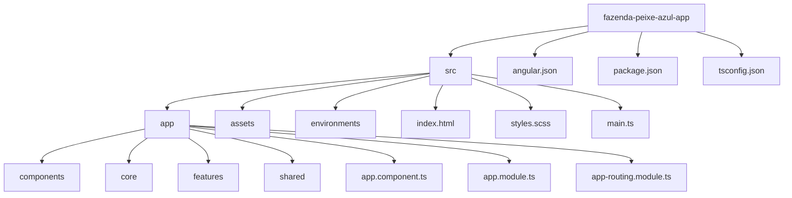
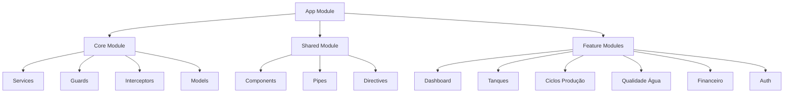
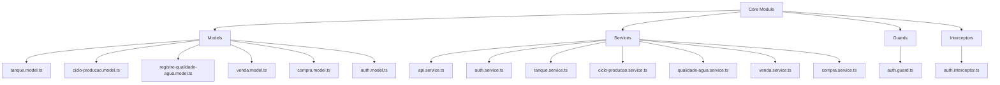
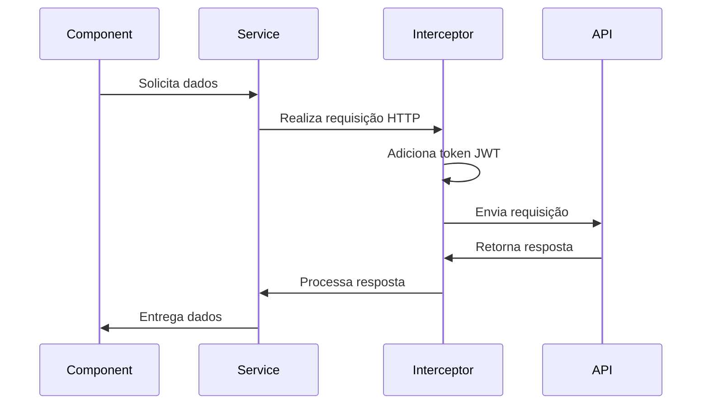
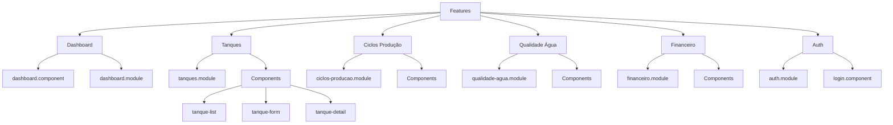
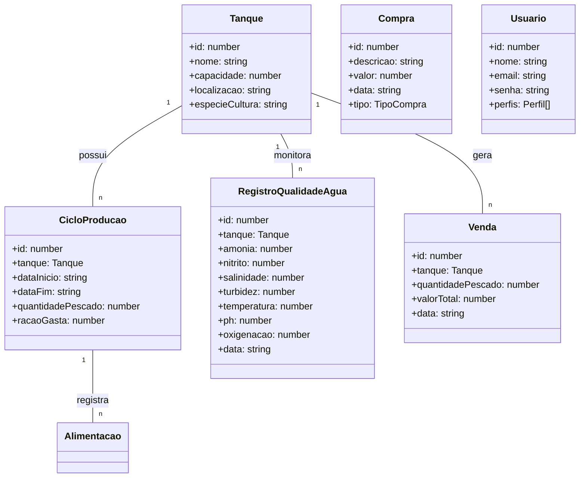
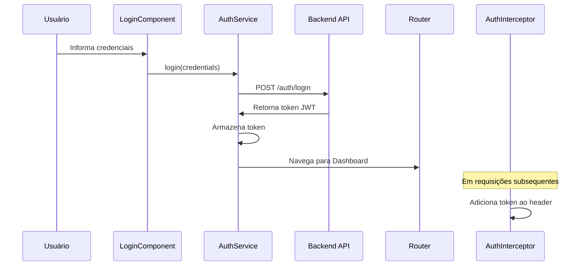
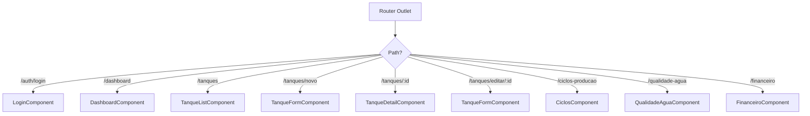
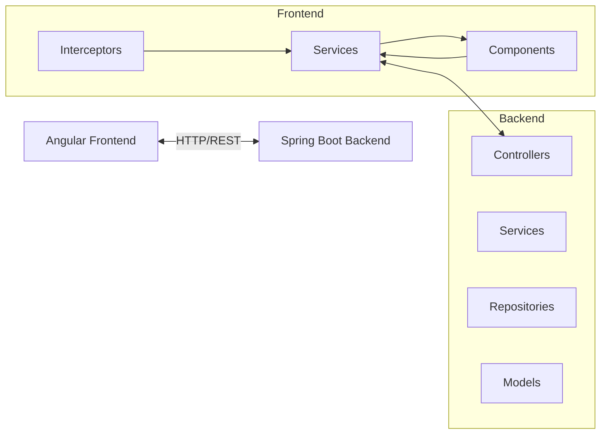

# Estrutura do Projeto Angular para Sistema de Gestão de Carinicultura

Este documento apresenta a estrutura do frontend do sistema de gestão para carinicultura, desenvolvido em Angular.

## Organização de Diretórios



## Arquitetura Modular

O projeto segue uma arquitetura modular, separando claramente as responsabilidades:



## Estrutura do Core

O módulo Core contém serviços, modelos e utilitários essenciais para a aplicação:



## Fluxo de Dados



## Módulos de Funcionalidades



## Modelo de Domínio



## Fluxo de Autenticação



## Rotas da Aplicação



## Integração com o Backend



## Configuração para Ambiente de Desenvolvimento

Para iniciar o desenvolvimento:

```bash
# Instalar dependências
npm install

# Iniciar servidor de desenvolvimento
ng serve

# Construir para produção
ng build --prod
```

## Expandindo o Sistema

Para adicionar novos componentes ou módulos:

```bash
# Gerar um novo módulo
ng generate module features/novo-modulo --routing

# Gerar um novo componente
ng generate component features/novo-modulo/novo-componente

# Gerar um novo serviço
ng generate service core/services/novo-servico
```
